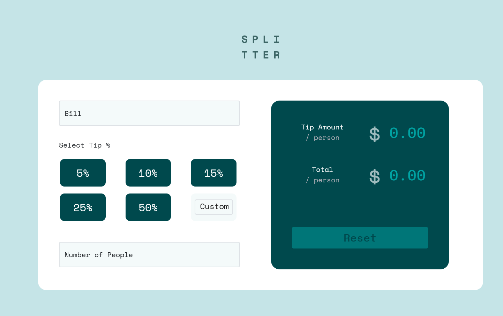
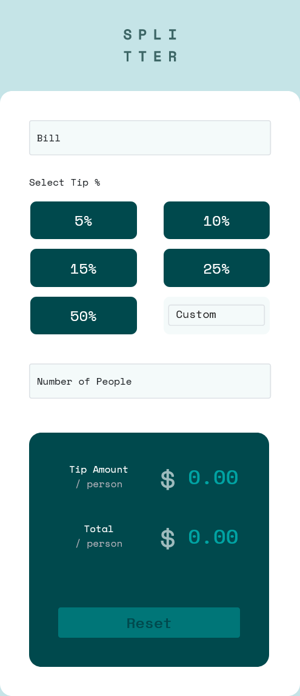

# Frontend Mentor - Tip calculator app
## Welcome! 👋

Thanks for checking out this front-end coding challenge.

[Frontend Mentor](https://www.frontendmentor.io) challenges help you improve your coding skills by building realistic projects.

# Frontend Mentor - tip calculator application solution

A Personal project.

This is a solution to the [tip calculator app](https://www.frontendmentor.io/challenges/tip-calculator-app-ugJNGbJUX/hub/tip-calculator-app-9lE7Q3kV5). Frontend Mentor challenges help you improve your coding skills by building realistic projects.

## Table of contents

- [Overview](#overview)
  - [The challenge](#the-challenge)
  - [Screenshots](#screenshots)
  - [Links](#links)
- [My process](#my-process)
  - [Built with](#built-with)
  - [What i learned](#what-i-learned)
  - [Continued development](#continued-development)
  - [Useful resources](#useful-resources)
- [Authors](#authors)
- [Acknowledgments](#acknowledgments)

## Overview

## The challenge

the challenge is to build out this tip calculator app and get it looking as close to the design as possible.

Your users should be able to:

- View the optimal layout for the app depending on their device's screen size
- See hover states for all interactive elements on the page
- Calculate the correct tip and total cost of the bill per person


### Screenshots



Screenshot of the general overview of the site in desktop view.
 


Screenshot of the general overview of the site in mobile view.

### Links

- Solution URL: [Challenge Solution](https://www.frontendmentor.io/challenges/sunnyside-agency-landing-page-7yVs3B6ef/hub/sunnyside-agency-landing-page-ESM-9dMZl)
- Live Site URL: [Loopstudios](https://iraytee-code.github.io/sunnyside-agency-landing-page-main/)

## My process

- I set up the base project by _creating the GitHub repository_, _setting up global styling_, _including the required assets_, and so on. I then proceeded to code the calculator sections of the project and after I was done, then i worked on the javascript to ensure interactivity between the userand the system.

During the entire project life cycle i followed courses online to get  thoughts and ideas on how to make the project meet web standards and kept track of our overall progress.

### Built with

- Semantic HTML5 markup
- CSS Flexbox
- Desktop-first workflow
- Vanilla Javascript
- [Inkscape](https://inkscape.org) - Inkscape: Open Source Scalable Vector Graphics Editor

### What I learned

-  Before this project, I had no idea that you could set mutliple images to show for different screen sizes using the `<picture>` element.

```javascript
function calcTip(e) {
    // increase opacity of reset button
    document.getElementById("reset").style.opacity = 1;
    // check if coming from fixed value tips
    e? errorHandler(e.target):null;
    // checks for error input ... must be all valid to calculate
    if(customTip.checkValidity() && bill.checkValidity()
             && people.checkValidity() && people.value != ""){
                totalTip = (tip * bill.value) /100;
                tipPerPerson = totalTip / people.value;
                totalPerPerson = (Number(bill.value) + totalTip) / people.value;
                tipPersonElement.innerHTML = round(tipPerPerson);
                totalPersonElement.innerHTML = round(totalPerPerson);
    }
}
```

### Continued development

-  I want to apply the features and best practices that I've learnt from working on this project to future projects.

### Useful resources

## Authors

- GitHub - [Adeniran Hope](https://github.com/iraytee-code)


## Acknowledgments

- personally being a self taught developer has made me quest for more in my journey and frontend mentors has provided the platform for me to challenge myself to be better everyday. 
[Back to top](#frontend-mentor---tip-calculator-main)